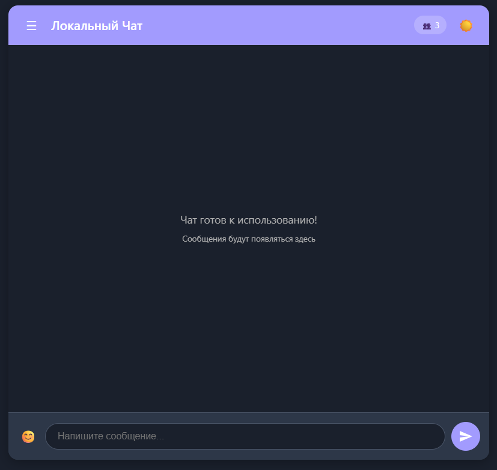

# Local Chat Application [](https://python.org) [](https://flask.palletsprojects.com/)

 <!-- Добавьте скриншот интерфейса -->

Простой локальный чат на Flask с возможностью:
- Обмена сообщениями в реальном времени
- Сохранения истории после перезагрузки
- Гибкой настройки сервера

## 🚀 Установка
```bash
# Клонирование репозитория
git clone https://github.com/Ivanmat90/messenger-local-rus.git
cd local_chat

# Установка зависимостей
pip install -r requirements.txt

# Запуск сервера
python server.py
```
Откройте `http://localhost:5000` в браузере.

## 🔧 Технологии
- **Backend**: Flask + Socket.IO
- **Frontend**: Vanilla JS
- **Хранение данных**: JSON-файл (история чата)

## 🤝 Как помочь проекту
- Добавьте фичи через Pull Request
- Сообщите о багах в Issues
- Поставьте ⭐ если проект полезен!
